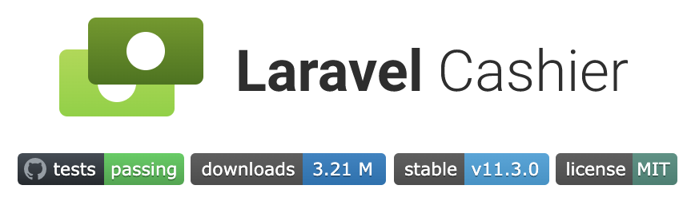

# 국제화의 필수 익스텐션, NumberFormatter



라라벨의 에코시스템 중에서 `Cashier`를 사용하시는 분은 많지 않을 것 같습니다. 그 이유는 `Cashier`는 라라벨 에코시스템 중 유일하게 사용 업체가 지정되어야 하기 때문입니다.

현재 라라벨 공식 홈페이지에서는 `Stripe`와 `Mollie` 두 업체를 공식적으로 지원하고 있습니다.

한국에서는 `아임포트`에서 라라벨 SDK를 비공식적으로 지원하고 있으나, 아쉽게도 구현 방법은 `Chshier` 규격을 따르지는 않습니다.

한국판 `Cashier` 제작을 위한 기본 지식으로 우리는 `NumberFormatter`에 대해서 알아야 합니다.

## Cashier 공식 문서에서의 제약

[Cashier 매뉴얼의 설정](https://laravel.com/docs/7.x/billing#configuration)을 보면 아래와 같은 문구가 있습니다.

> ... Internally, Cashier utilizes PHP's NumberFormatter class to set the currency locale:

그리고,

> {tip} In order to use locales other than en, ensure the ext-intl PHP extension is installed and configured on your server.

`en` 이외의 로케일을 지원하기 위해서 `ext-intl`을 설치해야 한다고 합니다. [NumberFormatter class](https://www.php.net/manual/en/class.numberformatter.php)는 [ext-intl 익스텐션](https://www.php.net/manual/en/book.intl.php)에 포함되어 있기 때문입니다.

## NumberFormatter란 무엇인가

ext-intl은 PHP 5.3.0부터 기본 탑재되어 있지만, PECL 버전도 있습니다. 내부적으로는 [ICU](http://site.icu-project.org/) 를 사용하고 있는데요, 사실 이 부분은 PHP에서 지금까지 정비가 되지 않고 있다가 PHP 7.4로 넘어오면서 정리가 되는 느낌입니다.

NumberFormatter는 PHP에만 있는 것은 아니고, 정규표현식처럼 많은 언어에서 지원합니다.

| Language or Framework      | Class or Object         |
| :------------------------- | :---------------------- |
| PHP                        | NumberFormatter Class   |
| Apple Foundation Framework | NSNumberFormatter Class |
| Java                       | NumberFormatter Class   |
| Spring Framework           | NumberFormatter Class   |
| Python                     | locale.format           |
| Javascript                 | Intl.NumberFormat       |

NumberFormatter는 숫자를 표현하는 방식에 로케일과 통화를 합친 클래스라고 볼 수 있습니다.

## 숫자를 통화로 표시하기

NumberFormatter를 사용하지 않을 경우 이런 코드를 작성하게 됩니다.

```php
<?php

$currency = '₩' . number_format(10000);

// $currency = ₩10,000
```

이 코드를 이렇게 쓸 수 있습니다.

```php
<?php

$currency =  (new NumberFormatter('ko_KR', NumberFormatter::CURRENCY))
    ->format(10000);

// $currency = ₩10,000
```

어, NumberFormatter가 더 복잡해 보이는군요. 그러면 이 코드는 어떨까요?

```php
<?php

echo number2hangul(12345);

// http://www.nuno21.net/bbs/board.php?bo_table=php&wr_id=2419
function number2hangul($number) {
    $num = array('', '일', '이', '삼', '사', '오', '육', '칠', '팔', '구');
    $unit4 = array('', '만', '억', '조', '경');
    $unit1 = array('', '십', '백', '천');

    $res = array();

    $number = str_replace(',','',$number);
    $split4 = str_split(strrev((string)$number),4);

    for($i=0;$i<count($split4);$i++){
            $temp = array();
            $split1 = str_split((string)$split4[$i], 1);
            for($j=0;$j<count($split1);$j++){
                    $u = (int)$split1[$j];
                    if($u > 0) $temp[] = $num[$u].$unit1[$j];
            }
            if(count($temp) > 0) $res[] = implode('', array_reverse($temp)).$unit4[$i];
    }
    return implode('', array_reverse($res));
}

// output
// 일만이천삼백사십오
```

이 코드를 이렇게 쓸 수 있습니다.

```php
<?php

echo (new NumberFormatter('ko_KR', NumberFormatter::SPELLOUT))
    ->format(12345);

// output
// 만 이천삼백사십오
```

코드의 간결성은 둘째치고, 전세계 모든 언어(Language)를 동일한 인터페이스로 코딩한다는 것이 큰 장점이 됩니다.

## 마치며

라라벨의 에코시스템을 한국에서도 모두 쓸 수 있도록 노력하고 있으며, 그 과정에 나오는 이슈를 가끔은 이런 식으로 공유하겠습니다. :)

NumberFormatter로 나오는 모든 출력물은 아래의 주소에서 확인할 수 있습니다.

[NumberFormatter 예재](../knowledge-acquisition/number-formatter.md)

오늘도 좋은 라라벨 생활 되시기 바랍니다.
