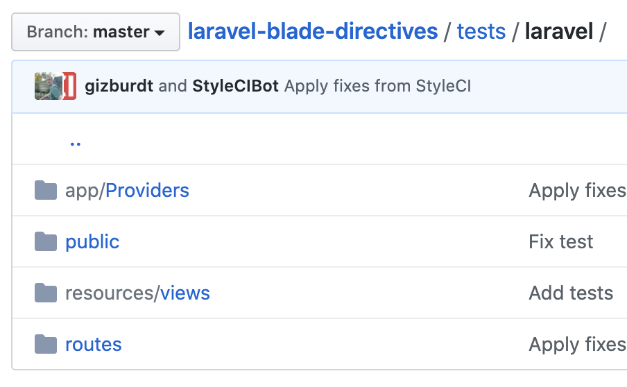

# 라라벨에서 뷰헬퍼를 만들어 봅시다

전통적인 MVC 프레임워크에서는 뷰에서 사용할 수 있는 뷰헬퍼 클래스를 확장하는 규격을 제공하고 있습니다.

저도 라라벨을 처음 접할 때 당연히 있을 줄 알았던 뷰헬퍼가 없어서 적잖이 당황했는데요, 대신 블레이드의 디렉티브라는 규격을 제공하고 있지만, 확장 규격이 없어서 고생한 적이 있습니다.

라라벨에서 뷰헬퍼를 사용하는 몇 가지 방법에 대해서 알아보도록 하겠습니다.

## 블레이드 디렉티브 확장(커스텀 디렉티브)

`AppServiceProvider`의 `boot()` 메쏘드에 `Blade::directive()`를 이용해서 만들어 줍니다.

[라라벨 공문의 예제](https://laravel.com/docs/7.x/blade#extending-blade):

```php
public function boot()
{
    Blade::directive('datetime', function ($expression) {
        return "<?php echo ($expression)->format('m/d/Y H:i'); ?>";
    });
}
```

이 방법의 문제점은 코드를 테스트 할 방법이 마땅치 않다는데 있습니다.

커스텀 블레이드 패키지 중 가장 많은 스타(709개)를 받은 [appstract/laravel-blade-directives](https://github.com/appstract/laravel-blade-directives) 패키지의 테스트 코드를 보면 실제로 넣는 코드에 비해서 테스트 코드가 매우 비대하다는 걸 알 수 있습니다.



## app 폴더 밑에 helpers.php 파일 만들기

[스택오버플로우에서 595개의 추천을 받은 답변](https://stackoverflow.com/a/28290359)으로, 오토로드 규격에 맞지 않기 때문에 다음과 같이 컴포져 파일에 오토로딩한다는 내용입니다.

```json
"autoload": {
    "classmap": [
        ...
    ],
    "psr-4": {
        "App\\": "app/"
    },
    "files": [
        "app/helpers.php" // <---- ADD THIS
    ]
},
```

제가 처음 라라벨을 사용할 때 쓰던 방법으로 더 이상은 사용하지 않습니다. 이유는 테스트가 되지 않거나 테스트 코드를 넣을 공간이 마땅치 않기 때문입니다.

## alias 이용하기

뷰헬퍼를 지원하는 프레임워크에서 뷰헬퍼는 뷰 안에서만 사용할 수 있는 클래스를 의미입니다. 그 클래스는 보통 Helper 클래스를 상속받아서 인스턴스 생성 절차를 생략할 수 있습니다.

어디선가 많이 듣던 내용 아닌가요? 그렇습니다. 라라벨 파사드가 아닌 일반적인 파사드와 유사합니다.

제가 사용하는 방법을 설명해 보겠습니다.

### 뷰헬퍼 클래스 생성

1. [독립적인 php 프로젝트를 생성](https://github.com/cable8mm/phpunit-start-kit)하고, 일반적인 뷰헬퍼 클래스의 모든 메쏘드를 static 메쏘드로 만들거나, 생성자 없는 인터페이스 구현을 위해서 팩토리 메쏘드를 만듭니다.
2. tests 폴더에 테스트 코드를 만듭니다.(phpunit-start-kit을 이용했다면 만들어져 있습니다.)
3. composer.json 파일에 아래의 내용을 추가해서 라라벨 프로젝트에 여러분이 작성한 코드가 alias 되게 합니다.

```json
 "extra": {
     "laravel": {
         "aliases": {
             "PrettyProfileHelper": "EscCompany\\ViewTransformer\\PrettyProfile",
             "WordBinderHelper": "EscCompany\\ViewTransformer\\WordBinder"
         }
     }
 }
```

위의 [컴포져 내용](https://github.com/esc-company/view-transformer/blob/main/composer.json)은 실제로 [사내 프로젝트에 적용중인 패키지](https://github.com/esc-company/view-transformer)의 일부입니다.

뷰헬퍼가 뷰 이외의 공간에서 사용되지 못하게 하는 방법은 없기 때문에, 저는 클래스 위에 Helper를 붙여서 뷰헬퍼 이외의 용도로는 사용하지 못하게 작은 컨벤션 규격을 만들었습니다.

> 클래스 이름 뒤에 'Helper'는 뷰헬퍼 이외의 클래스에는 붙이지 못한다.

이렇게 작성한 뷰헬퍼 코드는 블레이드 파일에서 아래와 같이 사용할 수 있습니다.

```blade
// .blade.php for laravel

{{ PrettyProfileHelper::profileImage($user->id, $user->profile_image_url) }}
```

만약 라라벨의 컨테이너와 연결해야 된다면 컴포져의 extra > providers 규격을 이용해서 서비스 프로바이더를 만들어 등록하세요.(자세한 내용은 공식문서의 [Package Development](https://laravel.com/docs/7.x/packages) 참조)

## 정리

뷰헬퍼와 같은 기능을 사용하기 위해서 위의 방법 이외에 특정한 부분에 억세서와 뮤테이터를 사용하기도 했습니다.

하지만, 사용하는 과정에서 스코프와 벨리데이션 때 충돌을 경험한 이후로는 뷰헬퍼를 위해서 억세스와 뮤테이터 코드를 작성하지는 않고 있습니다.

저의 방법은 어떻게 보면 일반적이지만, 라라벨 이외의 프레임워크나 Pure PHP에서도 사용할 수 있어서 만족하고 있습니다.

혹시 다른 식의 뷰헬퍼를 사용하고 계시다면 꼭 알려주시기 바랍니다.

오늘도 행복한 라라벨 생활 되시기 바랍니다.
