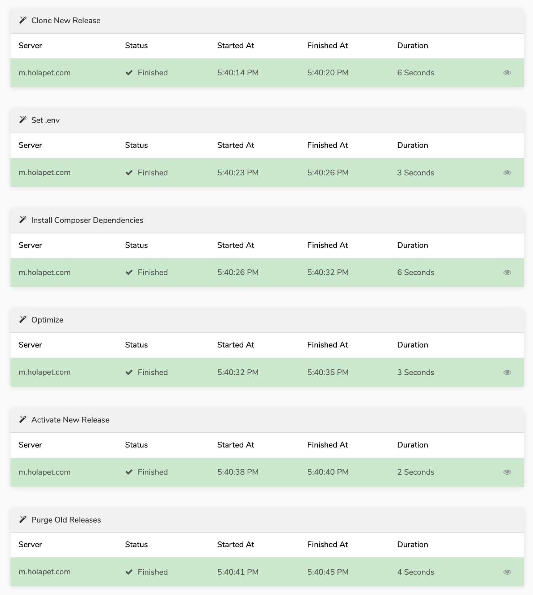

# Envoyer에서 무중단 배포를 구현하는 방법

라라벨을 도입하려는 분들에게 꼭 권하는 라라벨 에코시스템은 `Laravel Forge` 혹은 `Envoyer`입니다.

특히 `Envoyer`는 배포할 때 간단한 CI와 원클릭 롤백을 제공해 주며, 프로젝트 중간에 도입할 때 보다 처음에 도입하는 것이 훨씬 간단하기 때문입니다.

제가 처음 `Envoyer`를 도입하게 된 계기인 무중단 배포와 롤백이 어떻게 작동하는지 알아보겠습니다.

## 심볼릭 링크를 이용한 배포

`Envoyer`를 도입하기 전에 해야 할 것은 아래의 명령어입니다.

```bash
php artisan storage:link
```

이 명령어는 storage를 `public` 폴더의 바깥으로 빼주고, 심볼릭 링크를 걸면서 배포시에 사용자가 업로드한 이미지 등과 소스가 겹치지 않게 해 줍니다.

`Envoyer`는 이 링크를 프로젝트의 Root 와 동일한 계층으로 다시 심볼릭 링크를 만듭니다.

실제 서버의 Root 디렉토리:

```text
current -> /home/user/releases/20200511084013/
releases
storage
```

releases 디렉토리:

```text
20200331041029/
20200331044332/
20200331104152/
...
```

`Envoyer`에서 자동이던 수동이던 배포가 시작되면 releases 디렉토리에 소스를 복사한 후 storage폴더에 심볼릭 링크를 걸고, current의 심볼릭 링크를 교체합니다.

## 심볼릭 링크를 이용한 롤백

롤백은 배포할 때 에러가 발생하면 자동으로 이루어지며, 관리자 모드에서 원클릭만으로 수동 롤백을 진행할 수 있습니다.

롤백도 배포와 마찬가지입니다. 롤백을 하려는 디렉토리에서 storage폴더에 심볼릭 링크를 걸고, current의 심볼릭 링크를 교체합니다.

그리고...이게 끝입니다! 매우 간단하죠.

## 라라벨이 아닌 프로젝트도 무중단 배포가 가능

무중단 배포에서 중요한 것은 소스 이외의 리소스들이 프로젝트 밖에 있어야 한다는 점입니다.

따라서, 캐시와 세션 폴더를 빼고 심볼릭 링크를 거는 명령어를 배포 스크립트에 추가해 주는 형식으로 어떤 프로젝트도 무중단 배포를 할 수 있습니다.

저흰 `Envoyer`를 이용해서 라라벨, CakePHP, Pure PHP 프로젝트 전체를 배포하고 있습니다.

## 부가 기능 소개

정말 많은 기능이 있습니다만, 제가 실제로 사용하는 기능 위주로 소개해 드립니다.

* 자동 배포

  깃헙과 인증이 연결되어 있으면, 깃헙 후킹으로 배포 엑션이 등록되어 커밋이나 PR이 이루어질 때 자동으로 배포할 수 있습니다.

* 후킹 스크립트

  총 8군데에 후킹 스크립트를 넣을 수 있는 공간을 제공합니다. 저희는 설정 파일 처리를 별도로 작성하여 이용하고 있으며, 라라벨이 아닌 프레임워크의 퍼미션 처리에도 사용합니다.

* 복수 서버 배포

  한 소스를 여러대의 서버에 배포할 수 있습니다. 만약 웹서버 2대에 배치서버 1대를 운영 중이더라도 같은 소스코드를 베이스로 이 기능을 사용하여 배포하는 시나리오를 적용할 수 있게 됩니다.

* 알림 & 복수 사용자 등록

  Slack으로 배포 성공 및 실패 알림을 받을 수 있으며, `Envoyer` 계정에 복수의 아이디를 만들어서 운영할 수 있습니다.

* 배포 후 접속 확인\(Health Checking\)

  뉴욕과 런던, 싱가폴에서의 핑 결과를 보여주며, 서버에서도 `Envoyer` 서버에 정해진 시간마다 핑을 날려서 양측의 Health를 체크해 줍니다. 물론 장애 발생시 Slack이 연결되어 있다면 알람을 보내줍니다.

처음 언급한 CI는 어떻게 하는지 궁금하시다고요?

후킹 스크립트에 `composer test` 한 줄을 넣으면 에러 발생시 배포가 중단됩니다.

## 마무리

라라벨이 도입한 컴포져와 DI 컨테이너는 에코시스템과의 연동을 더욱 광범위하게 만들어 주고 있습니다.

다른 프레임워크에 비해 라라벨의 최대 강점인데요, 라라벨과 공식적으로 연동되는 에코시스템에도 관심을 갖는다면 더 즐거운 라라벨 생활이 되지 않을까 하네요.

저희가 실제로 배포한 `Envoyer` 화면을 공유해 드립니다.



오늘도 즐거운 라라벨 되시기 바랍니다.
